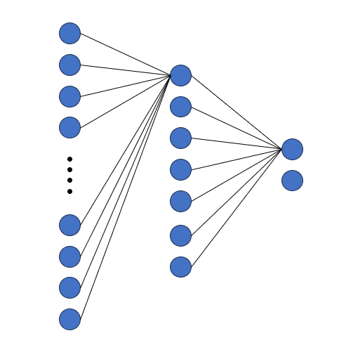
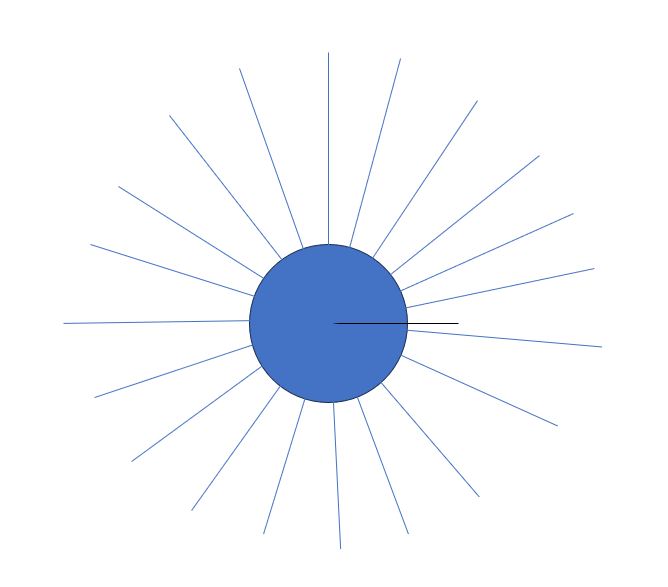
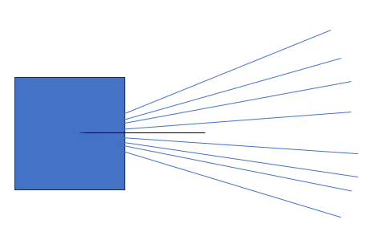

# Evolution Simulator

## What is Required?
python should be installed in your system

## What is this project?

This project tries to emulate a simulation of Preys and Predators.
<br>

### Entity
Entity can be either a Prey or a Predator. <br>
Entity consists of three traits:
1. Size: Size gives more health and more stored energy to an entity. However, a bigger size will also mean high evergy usage to stay alive.
2. Mobility: Mobility trait means how much maximum distance (pixels) an entity can move in a single epoch.
3. Visibility: Visibility is the distance (in pixels) an entity can see as far.

All of these traits are eligible for mutations. 
Which means, for every act of reproduction there is a small probability the value of a trait 
of a child is different from the parent.

#### Brain of Entity


Every entity has a neural network as a brain. 
The neural network dictates which direction the entity should move and how much it should move.

The input to neural network is other entity (of the other type) in the vicinity.

### 1. Prey:


* Prey acts as the lowest being of the food chain.
* Every round the predator can gaze, and produce energy for itself.
* Every epoch there is a probability that a prey can reproduce.
* The vision of prey is 360 degrees, divided in 25 sectors.
* The neural network for preys contain 29 neurons in input layer - 25 for if any predator is present in a sector. 4 for prey's distance from each of 4 edges of canvas.


### 2. Predator

* Predator eats a prey to generate energy
* Every round there is a probability that predator will reproduce.
* Vision of predator is only 75 degrees divided in 10 sectors. But predator can look till very far
* The neural network of predator contains 14 neurons as input layer. 10 for each sector and 4 for distance from each corner.


## How to run?

#### Step 1:
```commandline
    git clone https://github.com/Blaze404/EvolutionSimulation.git
```

#### Step 2:
Create a virtual environment
```commandline
    python -m venv venv
```
Enter the virtual environment (windows command below)
```commandline
    venv/scripts/activate
```
Install requirements
```commandline
    pip install -r requirements.txt
```

#### Step 3:
```commandline
    python main.py
```